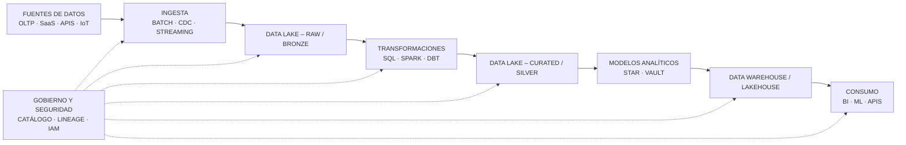

# Arquitectura de Datos – Documento de Referencia

## 1. Objetivo
Este documento describe una **arquitectura de datos de referencia** pensada para ambientes **on‑premise, Azure, AWS, GCP y OCI**, con foco en el **viaje completo de los datos**, sus **transformaciones**, seguridad y consumo analítico.

---

## 2. Principios de Diseño

- Separación de **almacenamiento y cómputo**
- Arquitectura **escalable y desacoplada**
- SQL como lenguaje común
- Datos gobernados desde el origen
- Automatización y observabilidad end‑to‑end
- Diseño cloud‑agnostic

---

## 3. Capas de la Arquitectura

### 3.1 Fuentes de Datos

- Sistemas OLTP (ERP, CRM, Core)
- Bases de datos on‑premise (SQL Server, Oracle, PostgreSQL)
- Aplicaciones SaaS
- Logs, eventos e IoT
- APIs externas

Características:
- Alta variabilidad de formatos
- Datos estructurados y no estructurados

---

### 3.2 Ingesta de Datos

Modos de ingesta:
- **Batch** programado
- **CDC (Change Data Capture)**
- **Streaming / eventos**

Herramientas típicas:
- Azure Data Factory / Fabric Pipelines
- AWS Glue / DMS
- GCP Dataflow
- OCI Data Integration
- Kafka / Event Hubs / PubSub

---

### 3.3 Almacenamiento – Data Lake

El Data Lake se organiza en **zonas lógicas**:

- **RAW / BRONZE**  
  Datos crudos, sin transformar

- **CURATED / SILVER**  
  Datos limpios, tipificados y validados

- **SEMANTIC / GOLD**  
  Datos listos para consumo analítico

Formatos comunes:
- Parquet
- Avro
- ORC

---

### 3.4 Transformaciones

Estrategia **ELT predominante**:

- Limpieza y estandarización
- Aplicación de reglas de negocio
- Enriquecimiento
- Historificación (SCD)
- Modelado analítico

Tecnologías:
- SQL
- Spark (Databricks, EMR, Dataflow)
- dbt

---

### 3.5 Capa Analítica

Opciones:

- Data Warehouse Cloud
- Lakehouse
- Motores serverless

Ejemplos:
- Azure Synapse / Fabric
- Amazon Redshift
- Google BigQuery
- OCI Autonomous DW

---

### 3.6 Consumo de Datos

- BI y Reporting (Power BI, Tableau, Looker)
- Data Science y ML
- APIs de datos
- Casos operacionales

---

### 3.7 Gobierno, Seguridad y Observabilidad

Transversal a toda la arquitectura:

- Catálogo de datos
- Data lineage
- Calidad de datos
- IAM y RBAC
- Encriptación
- Auditoría
- Monitoreo de pipelines

---

## 4. Viaje de los Datos – Diagrama de Referencia

---

## 5. Responsabilidades del Arquitecto de Datos en esta Arquitectura

- Definir patrones y estándares
- Diseñar el flujo completo de datos
- Seleccionar tecnologías adecuadas
- Garantizar calidad y seguridad
- Alinear la arquitectura con el negocio
- Planificar evolución y escalabilidad

---

## 6. Resumen Ejecutivo

Esta arquitectura permite:

- Flexibilidad tecnológica
- Escalabilidad horizontal
- Gobierno de datos efectivo
- Soporte para analítica avanzada e IA
- Operación consistente en on‑premise y multi‑cloud

---

**Documento diseñado como referencia viva, adaptable a las necesidades de cada organización.**
